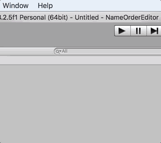
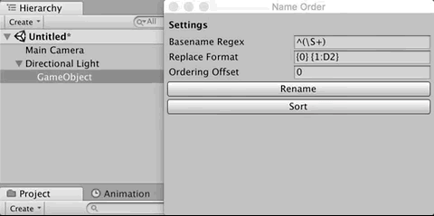
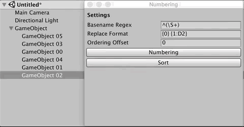

# NumberingEditor

Numbering GameObject on Unity3D

## Install

Install from latest unitypackage!

- https://github.com/mattak/NumberingEditor/releases

or ad following to your `Packages/manifest.json`

```
"me.mattak.numberingeditor": "https://github.com/mattak/NumberingEditor.git?path=Assets/Plugins/NumberingEditor"
```

## Usage

Open `Numbering` window.
(Unity3D > Window > Numbering)



Numbering GameObject



Sort by name order



## Settings

Basename Regex
- Regex format to specify basename
- Regex first matched group (`match.Group[1]`) is used for rename
- e.g. If regex is `^Game(\S+)` and gameobject name is `GameObject abc`, then is `Object` is used as basename

Replace Format
- Rename Format by using `string.Format`
- `{0}` is placed by basename.
- `{1}` is name order position.

Ordering offset
- Offset number for name order position.
- e.g. If 10, then rename number start from 10.

## LICENSE

- [MIT](./LICENSE.md)
